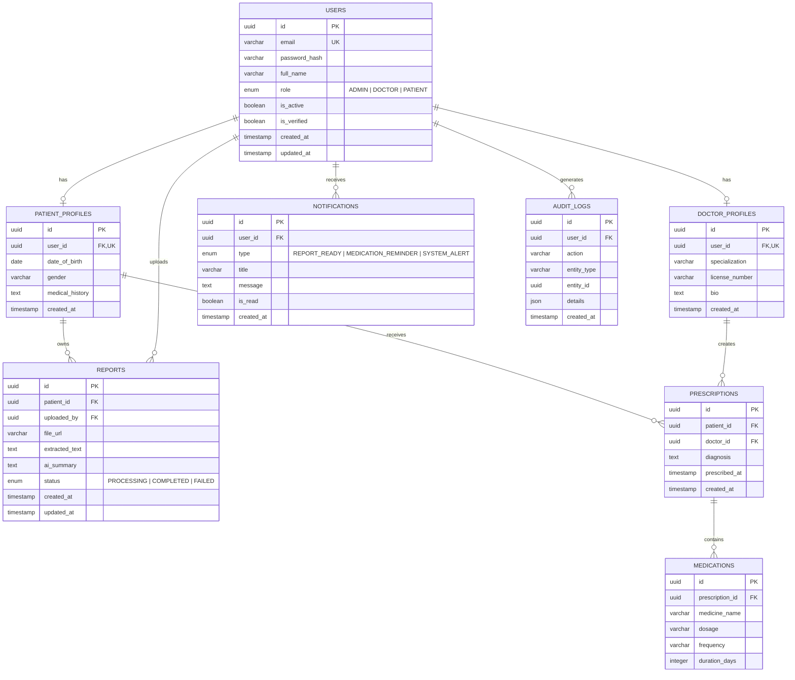

**ER Diagram — SmartMed**

**Overview**

This Entity-Relationship diagram represents the database schema for SmartMed, an AI-powered health report management platform designed to support patients, doctors, and administrators through structured medical data workflows.

The schema models:

• Role-based authentication
• Doctor & patient profile separation
• Medical report storage
• AI summary generation
• Prescription workflow
• Medication tracking
• Payment support (optional future extension)
• Notification system
• Audit logging

The system is designed following real-world healthcare workflow modeling and scalable backend design principles.

**Table Summary**

| Table              | Description                                 | Key Relationships                  |
| ------------------ | ------------------------------------------- | ---------------------------------- |
| `USERS`            | All platform users (admin, doctor, patient) | → Profiles, Reports, Notifications |
| `DOCTOR_PROFILES`  | Doctor-specific professional details        | ← User (1:1), → Prescriptions      |
| `PATIENT_PROFILES` | Patient demographic + health metadata       | ← User (1:1), → Reports            |
| `REPORTS`          | Uploaded medical reports + AI summaries     | ← Patient                          |
| `PRESCRIPTIONS`    | Doctor-issued treatment records             | ← Doctor, Patient                  |
| `MEDICATIONS`      | Medication details under prescriptions      | ← Prescription                     |
| `NOTIFICATIONS`    | Alerts and reminders                        | ← User                             |
| `AUDIT_LOGS`       | System activity logging                     | ← User                             |

**Key Indexes**

| Table           | Index                      | Purpose                    |
| --------------- | -------------------------- | -------------------------- |
| `USERS`         | `(email)`                  | Fast authentication lookup |
| `REPORTS`       | `(patient_id, status)`     | Fetch patient reports      |
| `PRESCRIPTIONS` | `(patient_id, doctor_id)`  | Treatment history          |
| `MEDICATIONS`   | `(prescription_id)`        | Medication lookup          |
| `NOTIFICATIONS` | `(user_id, is_read)`       | Unread notifications       |
| `AUDIT_LOGS`    | `(entity_type, entity_id)` | Audit tracing              |

