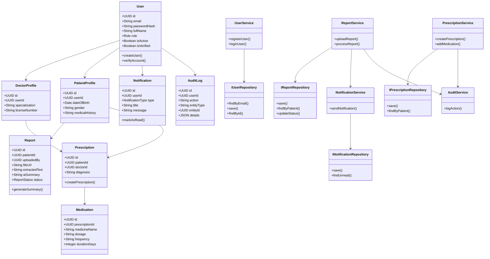

# Class Diagram — SmartMed

## Overview

This class diagram represents the major domain models, services, repositories, and architectural layers of the SmartMed platform.

The system follows Clean Architecture principles with strict separation between Controllers, Services, and Repositories. The design emphasizes backend-heavy system modeling and applies core Object-Oriented Programming (OOP) concepts and design patterns to ensure scalability, maintainability, and clear separation of concerns.

---

## Architectural Layers Represented

- Controllers — Handle HTTP request/response lifecycle
- Services — Contain business logic
- Repositories — Abstract database access
- Domain Models — Represent core entities
- Middleware — Handle authentication and authorization
- Utilities — Shared helper components

---

---

## Design Patterns in the Class Diagram

| Pattern | Where Applied | Purpose |
|----------|---------------|----------|
| Repository | IUserRepository, IReportRepository | Decouples database access from business logic |
| Service Layer | UserService, ReportService, PrescriptionService | Centralizes business logic |
| Singleton | Database Connection | Single shared DB instance |
| Facade | Services | Simplifies complex operations |
| Role-Based Strategy | User role behavior | Controlled role logic without class explosion |

---

## OOP Principles Applied

| Principle | Application |
|------------|--------------|
| Encapsulation | Domain models expose behavior via methods |
| Abstraction | Repository interfaces hide persistence details |
| Inheritance | Role-based user handling |
| Polymorphism | Services interact with repository interfaces |

---

## Architectural Decisions

- Controllers remain thin and delegate logic to services.
- Services depend on repository interfaces, not concrete implementations.
- Domain models contain minimal business behavior.
- Audit logging is triggered inside service layer operations.
- Notifications are handled asynchronously via service abstraction.

---

## Backend Emphasis

The class structure is intentionally backend-heavy to demonstrate:

- Clear separation of concerns
- Scalable layered architecture
- Clean dependency direction
- Enterprise-level system design modeling

