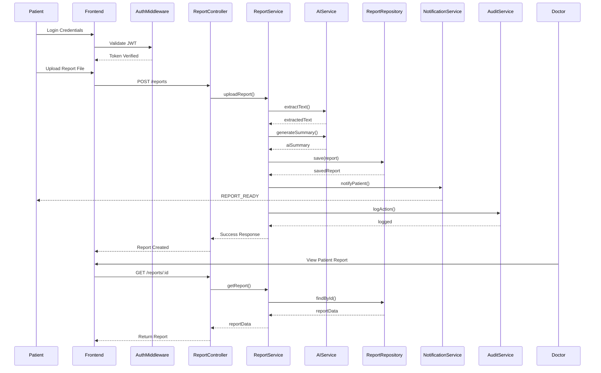

# Sequence Diagram — SmartMed

## Main Flow: End-to-End Medical Report Processing  
(Patient Upload → AI Processing → Doctor Access → Notification & Audit Logging)

This sequence diagram illustrates the complete lifecycle of a medical report in the SmartMed platform — from a patient uploading a report, through AI processing and summary generation, to doctor access and system notifications.

The flow highlights authentication, service orchestration, repository abstraction, and audit logging.

---

## Flow Summary

| Phase | Description | Key Patterns Used |
|--------|------------|------------------|
| 1. Authentication | Patient logs in and receives JWT token | RBAC, JWT Middleware |
| 2. Report Upload | Patient uploads report file | Service Layer |
| 3. AI Processing | System extracts text & generates summary | Facade, External API |
| 4. Persistence | Report stored in database | Repository Pattern |
| 5. Doctor Access | Doctor retrieves patient report | Abstraction |
| 6. Notification | Patient notified of completed processing | Observer Pattern |
| 7. Audit Logging | Action logged for traceability | Cross-Cutting Concern |

---

---

## Architectural Observations

- Controllers remain thin and delegate to services.
- Business logic resides inside service layer.
- Repository abstraction isolates database concerns.
- AI integration is encapsulated within AIService.
- Notifications are triggered post-transaction.
- Audit logging is treated as a cross-cutting concern.

---

## Backend Engineering Focus

This flow demonstrates:

- Clean separation of layers
- External API integration
- Asynchronous notification workflow
- Secure role validation
- Persistent audit tracking
- Scalable backend design

The sequence is intentionally designed to reflect enterprise-grade backend orchestration rather than simple CRUD operations.

