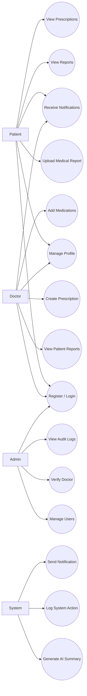

# Use Case Diagram — SmartMed

## Overview

This diagram represents the major use cases of the SmartMed platform, categorized by the primary actors: Patient, Doctor, Admin, and System.

The system focuses on structured medical report workflows, AI-powered processing, prescription management, secure role-based access control (RBAC), and audit transparency.

The diagram models backend-driven healthcare interactions rather than UI-only actions.

---

## Use Case Descriptions

| # | Use Case | Actors | Description |
|----|----------|--------|------------|
| UC1 | Register / Login | All | Authenticate users using JWT-based authentication and role assignment. |
| UC2 | Manage Profile | Patient, Doctor | Update personal details and account settings. |
| UC3 | Upload Medical Report | Patient | Upload medical report files for backend processing. |
| UC4 | Generate AI Summary | System | Extract report text and generate AI-based summary. |
| UC5 | View Reports | Patient | View uploaded reports and AI summaries. |
| UC6 | View Patient Reports | Doctor | Access patient reports for diagnosis. |
| UC7 | Create Prescription | Doctor | Create a prescription linked to a patient. |
| UC8 | Add Medications | Doctor | Add medications under a prescription. |
| UC9 | View Prescriptions | Patient | View prescription history and active medications. |
| UC10 | Receive Notifications | Patient, Doctor | Receive system alerts and updates. |
| UC11 | Manage Users | Admin | Activate, deactivate, or update user roles. |
| UC12 | Verify Doctor | Admin | Approve or reject doctor registrations. |
| UC13 | View Audit Logs | Admin | Monitor system-level actions and logs. |
| UC14 | Log System Action | System | Record critical system operations. |
| UC15 | Send Notification | System | Trigger notifications for events. |

---

---

## Architectural Observations

- All actors authenticate through a unified JWT-based system.
- Business logic is handled via the service layer.
- AI processing is encapsulated within a system-driven service.
- Audit logging is treated as a cross-cutting concern.
- Notifications are triggered as event-based backend operations.

---

## Backend Emphasis

This use case structure demonstrates:

- Clear role-based separation
- Automated system workflows
